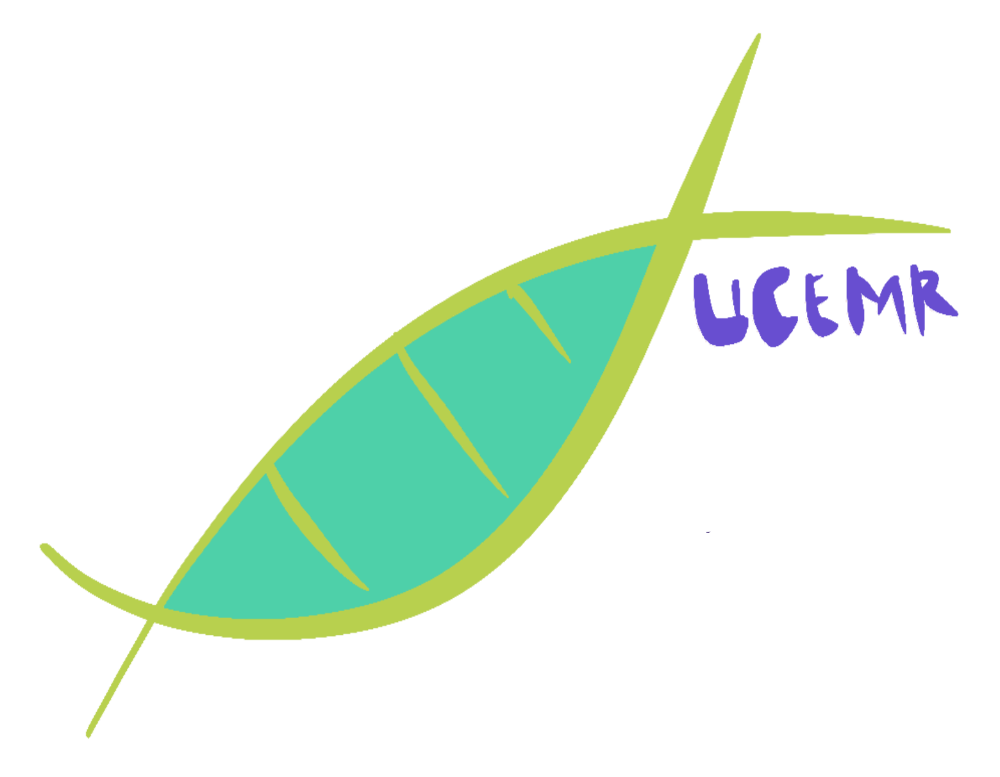
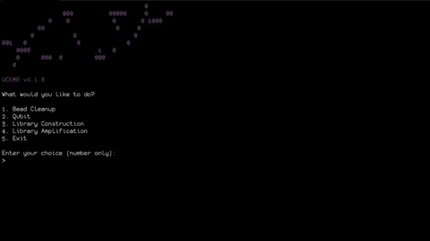

<p align='center' style='font-size:30px;'>

<br>
<i>An interactive command line app for ultra-conserved element genomic lab work.</i>
</br>
<br></br>
</p>

UCEMR is a simple command line application for ultra-conserved element (UCE) lab work. It is light, fast, and requires no dependencies. I develop UCEMR for one simple reason: to avoid reaching my phone when performing UCE lab work. It is not an essential tool, but it is nice to have while working in the lab. It provides calculator for making solution and preset timers for each protocol. I am planning to include lab manuals into the app. 

Warning: The app is fine-tuned following <a href= 'https://esselstyn.github.io/'>Esselstyn's lab</a> protocols. Anyone is welcome to adapt for their labs. Feel free to contact me for questions about modifying the app.

## Installation
Currently, UCEMR only supports Linux and MacOS. Windows users can run it using <a href= 'https://docs.microsoft.com/en-us/windows/wsl/install-win10'>Windows Subsystem for Linux (WSL)</a>. 

### The Easiest Way
To run UCMR, you only need a binary file. It is available for Linux and Intel-based MacOS for download: https://github.com/hhandika/uce-master-race/releases. Download the latest version and run it like other command line applications using your terminal. 

### A Little Adventure (Compiling from the Source Code)

To compile the code, you will need C compiler (GCC or Clang) and GNU Make that support the C11 standard.

1. Clone the project github repo to your computer.

```
git clone https://github.com/hhandika/uce-master-race.git
```

2. Using your shell, navigate to UCEMR folder

```
cd uce-master-race/ucemr/
```
3. Compile the code using gnu make.

```
make
```
4. An executable will be created in a bin folder inside UCEMR folder.
```
bin/ucemr
```
5. You can copy ucemr to a path registered in your .zhrc or .bash_profile file.

