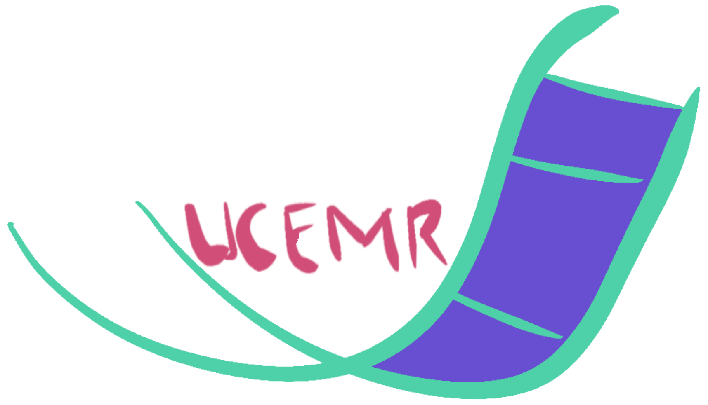

A simple tool for UCE labwork.

This repo will host a small program to assist laboratory work on ultra-conserved element. It is work in progress. The program is working with limited functionality. The code needs to be refactored.
